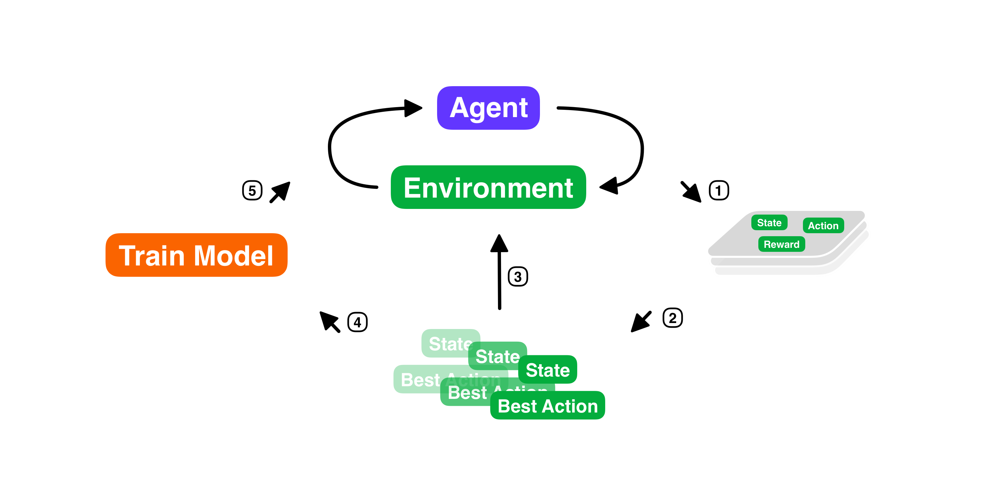

# Gym-Resolver

Let's solve **OpenAI Gym** environments with some good old ways.


## Requirments

```bash
gym==0.18.0
numpy==1.21.5
imblearn==0.9.0
scikit-learn==0.24.0
xgboost==1.5.2
```





## Cycle

1. Play some game and gather state-action-reward data.
2. Distill a fine memory table based on reward.
3. (Optional) Use memory table, play and gather more data.
4. Get **X**-**y** data and train a model for control.
5. Use trained model, play and gather more data.


## Usage/Examples

Will be added soon with details..

